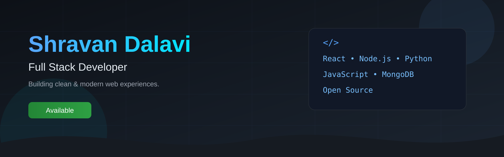
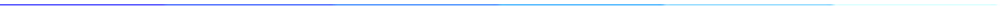
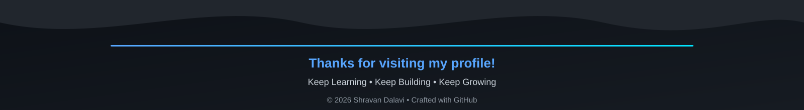

<h1 align="center">Hi 👋, I'm Shravan Dalavi</h1>
<h3 align="center">Beyond the Browser- My Web Development Journey</h3>

  

* 🌱 Currently learning **React Native & Backend Development**
* 💬 Ask me about **React, JavaScript, Web Development, Photoshop**
* 📫 Email: **[shravandalavi137@gmail.com](mailto:shravandalavi137@gmail.com)**
  

             

## 🌐 Connect with Me

  
  
  
  
  
  
  
  
  

## 🛠️ Languages and Tools

  

<h3 align="left">💻 Additional Tools & Technologies:</h3>

             

<!-- GitHub Stats -->

<!-- Top Languages -->

